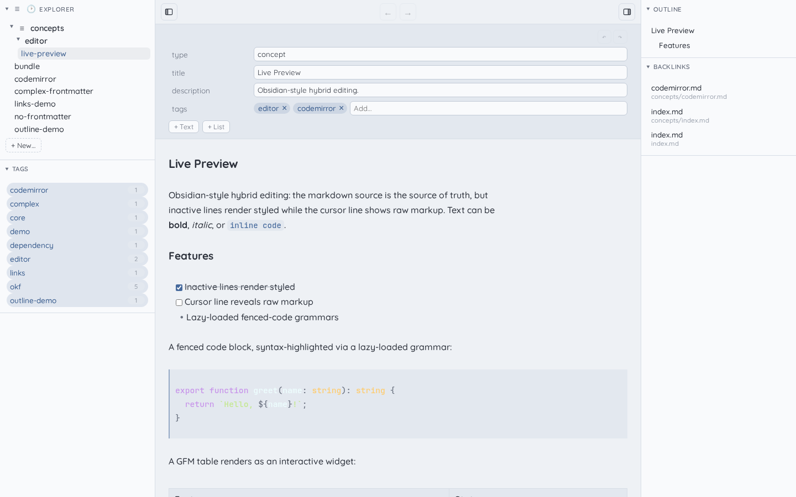
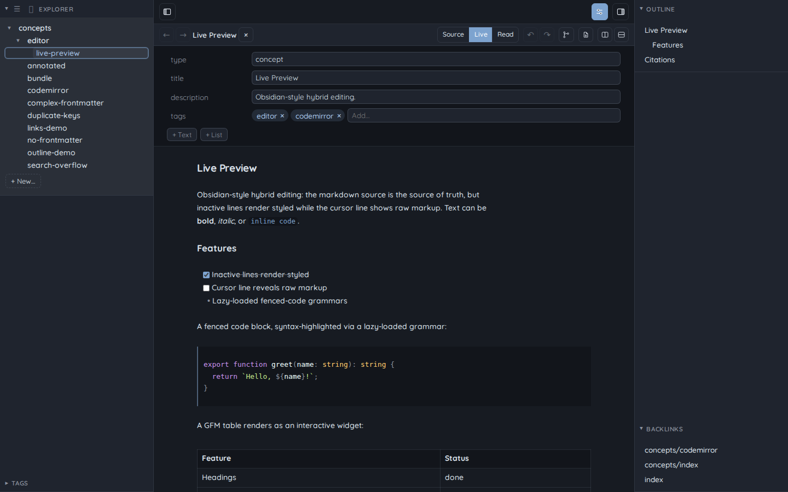
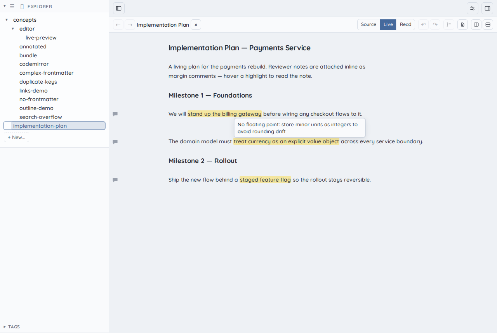
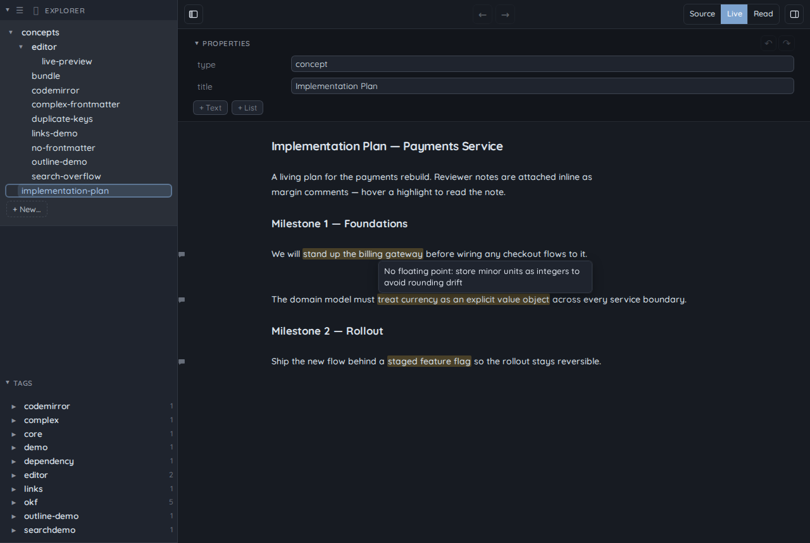

<div align="center">


# Sapphire

**A lightweight markdown editor — a slimmed-down Obsidian. Fast, focused, no bloat.**

</div>

Sapphire is a desktop markdown editor for people who want the good parts of a
knowledge base — live preview, wikilinks, backlinks, properties, tags, instant
search — without the plugin sprawl and proprietary lock-in. It opens a plain
folder of markdown files and gets out of your way.

---

## Open any folder. No vault required.

There is no proprietary "vault" to create, import, or convert into. Sapphire
runs against **any** folder of markdown files. Point it at an existing
directory — your notes, your docs repo, a cloned knowledge base — and start
editing. Your files stay plain `.md` on disk, readable by every other tool you
already use, and portable the moment you close the app.

## Built for the Google Open Knowledge Format

Sapphire has first-class support for the
[**Open Knowledge Format (OKF)**](https://cloud.google.com/blog/products/data-analytics/how-the-open-knowledge-format-can-improve-data-sharing/) —
Google's open standard for sharing knowledge as portable, agent-readable,
vendor-neutral markdown bundles.

OKF is intentionally minimal: a directory of markdown files with YAML
frontmatter describing typed concepts. There is no schema registry, no central
authority, and no required tooling — if you can `cat` a file you can read OKF,
and if you can `git clone` a repo you can ship it. That makes a Sapphire
knowledge base equally consumable by humans, by AI agents, and by any other
editor, with nothing to migrate and no vendor to depend on.

Sapphire's frontmatter model (the typed-concept `type` / `title` / `tags`
fields, reserved files, and bundle structure) conforms to the OKF spec:

- Upstream spec: <https://github.com/GoogleCloudPlatform/knowledge-catalog/blob/main/okf/SPEC.md>
- Vendored copy in this repo: [`docs/okf-spec.md`](docs/okf-spec.md)

## Features

- **Live preview** — Obsidian-style hybrid editing: inactive lines render
  styled while the cursor line shows raw markup, with syntax-highlighted fenced
  code, task lists, and interactive GFM tables.
- **Wikilinks + backlinks** — navigate links between concepts; every concept
  shows which others link to it.
- **Frontmatter / Properties panel** — edit typed frontmatter as structured
  fields (scalars, lists, tags) with complex YAML round-tripped verbatim.
- **Tag browser** — browse and filter your bundle by tag, with live counts.
- **Full-text search** — search across every concept with snippet results.
- **Quick-nav palette** — jump to any concept instantly from a fuzzy command
  palette.
- **Outline panel** — a live heading outline of the open concept for fast
  scrolling.
- **Annotations** — select any text and choose **Add comment** from the
  right-click menu (or press `Ctrl/Cmd+Alt+M`) to attach a margin comment in a
  small note popup — no markup to type. This works in reading mode too, the
  preferred way to review. Notes render out of the text flow: the highlighted
  span is marked, a comment icon sits in the gutter, and hovering reveals the
  note; clicking the icon reopens the popup to edit or remove it. They are plain
  [CriticMarkup](http://criticmarkup.com/) (`{==text==}{>>note<<}`) in the file,
  so they travel in git and any other tool can read them — ideal for leaving
  feedback on generated docs for an agent's next pass.
- **Right sidebar** — a second, collapsible sidebar housing Backlinks.
- **Light + dark theming** — a sapphire-blue palette that follows your OS color
  scheme.

## Screenshots

A live concept open against a real OKF bundle — Explorer, Properties, live
preview, Outline, Backlinks, and the Tag browser, all on screen.

### Light



### Dark



### Annotations

Margin comments on an implementation plan — highlighted spans, gutter comment
icons, and a hovered note. The annotations are CriticMarkup in the underlying
`.md`; the editor renders them out of the text flow.





## Development

Sapphire is built with [Tauri](https://tauri.app/),
[SvelteKit](https://svelte.dev/docs/kit), and TypeScript.

```sh
bun install          # install dependencies
bun run tauri dev    # run the desktop app
bun run build        # build the static SPA
bunx playwright test # run the end-to-end suite
```

### Web deployment

Sapphire can also be served as a read-only, server-rendered web viewer over a
Bundle, packaged as a single Docker image. See
[`docs/deploy-web.md`](docs/deploy-web.md) for the `docker compose` run and the
**internal-network / no-auth** caveat, and
[`docker/README.md`](docker/README.md) to back the served Bundle with a **git
repo** (sidecar / hook sync patterns, with a tested live-reload verdict). This is
separate from the desktop release flow.

## License

MIT
