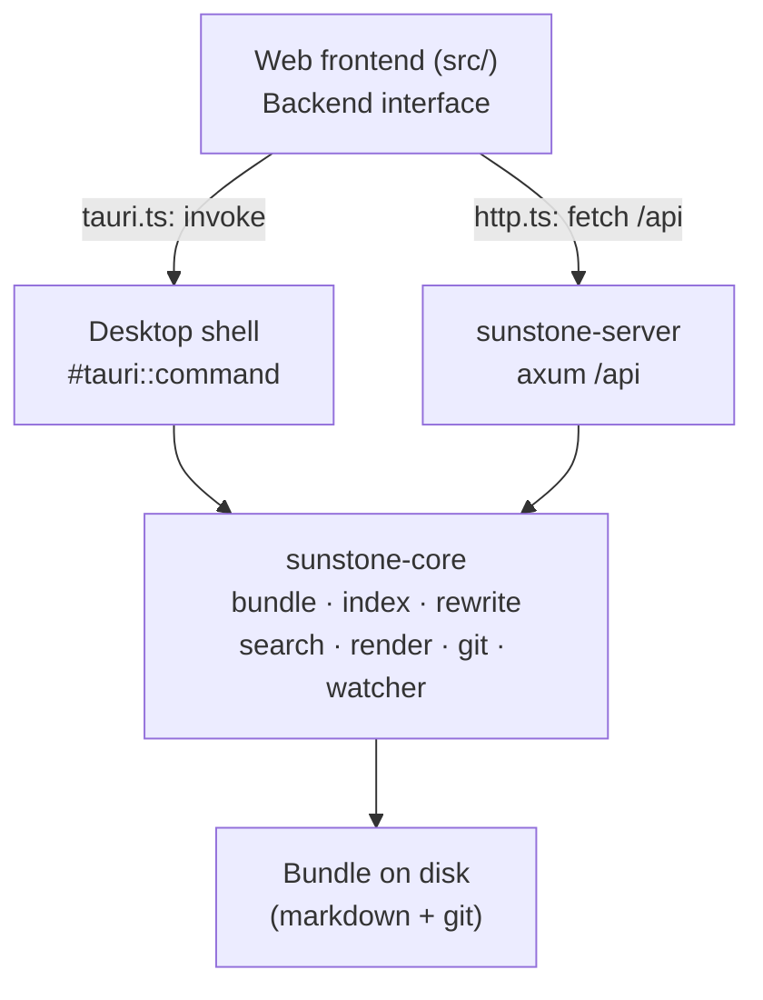
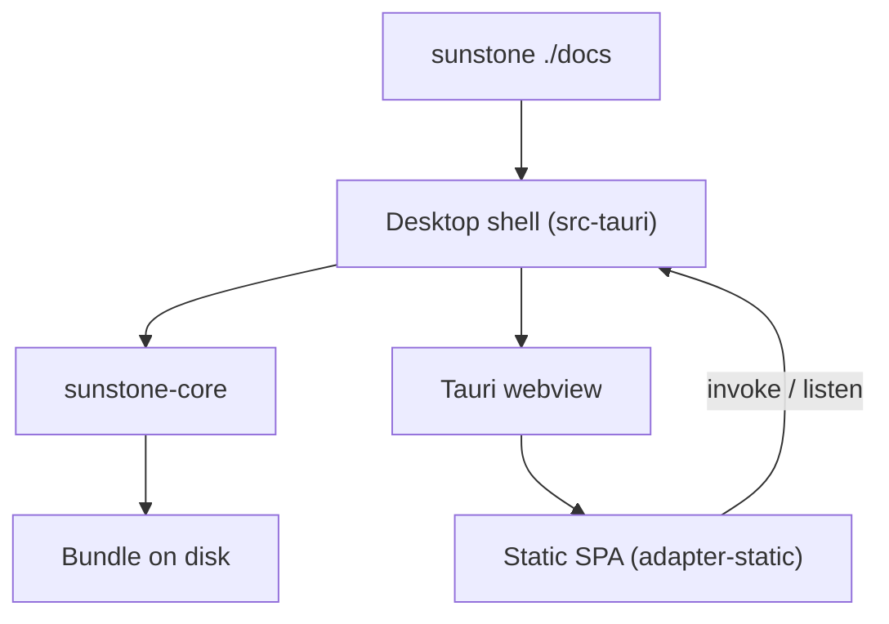
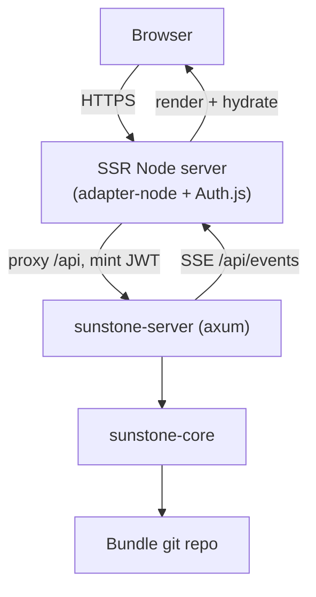

# Architecture overview

Sunstone is one codebase that ships two products — a **desktop editor** and a **read-only web viewer with an authenticated edit path** — over a **single shared domain crate**. Four packages make that work:

| Package | Language | Role |
| --- | --- | --- |
| [sunstone-core](/architecture/sunstone-core.md) | Rust | Host-agnostic Bundle logic — the hub everything else depends on. |
| [Desktop shell](/architecture/desktop-shell.md) (`src-tauri`) | Rust | Thin Tauri 2 wrapper exposing core over IPC commands. |
| [sunstone-server](/architecture/sunstone-server.md) | Rust | axum HTTP binary exposing core over a JSON/SSE API. |
| [Web frontend](/architecture/web-frontend.md) (`src/`) | SvelteKit | One UI that targets both hosts, decoupled by the IPC seam. |

## The central idea

All domain behaviour — filesystem, index, links, rewrite, search, render, git, watcher, config — lives **once**, in [sunstone-core](/architecture/sunstone-core.md). The desktop shell and the server are each a thin transport layer over it, and the frontend reaches whichever one is present through a single `Backend` interface. No feature logic is duplicated across hosts.

## Desktop path

`sunstone ./docs` launches the [desktop shell](/architecture/desktop-shell.md). The frontend is a static SPA (adapter-static) loaded into a Tauri webview; `isTauri` selects the `tauri.ts` backend, whose methods are `invoke(...)` calls to the shell's `#[tauri::command]`s. The shell delegates each to [sunstone-core](/architecture/sunstone-core.md) and runs core's filesystem watcher, emitting change events back over Tauri IPC. Everything is in one process on the user's machine; there is no network and no auth, and the desktop never commits to git.

## Web path

Sunstone Web is **two processes** behind one public origin. The SvelteKit app is built with adapter-node (SSR) and run as a Node server; it owns the origin, renders the [WebViewer](/architecture/web-frontend.md), handles Auth.js sign-in, and proxies `/api/*` to the [sunstone-server](/architecture/sunstone-server.md) Rust binary on an internal port. The frontend's `http.ts` backend talks only to that same-origin `/api`. Reads are open; on a write the Node proxy mints a short-lived HS256 JWT from the session and forwards it, which the server verifies before committing through core's git primitive. Live updates flow server → browser over SSE (`/api/events`).

Both processes ship as a single Docker image; see `docker/README.md` for the run and the internal-network / open-reads caveat.

## What crosses each seam

- **Same types both ways.** Whether over Tauri IPC or HTTP, the payloads are the [sunstone-core](/architecture/sunstone-core.md) serde structs (`camelCase`), mirrored in the frontend's `src/lib/types.ts`. The `Backend` interface hides which transport is in play.
- **Bundle-relative, forward-slash paths** cross every seam; path-escape is rejected in core, so the server's network edge and the desktop's IPC edge share one guard.
- **Change events** originate in core's watcher and reach the frontend either as a Tauri event (desktop) or an SSE message (web) — the frontend's `onFileChanged` is identical.

## Relationships

- Each package has its own page: [sunstone-core](/architecture/sunstone-core.md), [desktop shell](/architecture/desktop-shell.md), [sunstone-server](/architecture/sunstone-server.md), [web frontend](/architecture/web-frontend.md).
- The Bundle these packages operate on is defined in [OKF → Bundle](/okf/bundle.md); the link model core implements is [Linking](/okf/linking.md).
- How the assembled stacks are tested is [Testing](/architecture/testing.md).
