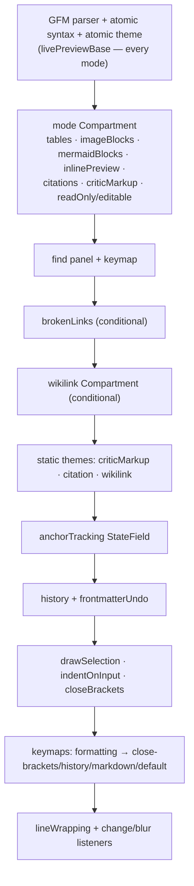

# CodeMirror integration

Sunstone's text editor is a **CodeMirror 6** `EditorView` built on Obsidian-style hybrid live preview: the markdown source is the on-disk truth, inactive lines render styled, and the cursor line shows raw markup. The decision to build on CM6 + [atomic-editor](/editor/atomic-editor.md) rather than a WYSIWYG editor is [ADR-0001](/adr/0001-codemirror-hybrid-live-preview.md); this page documents _how_ the pieces are wired together.

The keystone module is **`src/lib/editor/cm.ts`** — the editor _builder_. It owns no rendering logic of its own; it assembles the [atomic-editor extensions](/editor/atomic-editor.md) and [Sunstone's own CM extensions](/editor/custom-extensions.md) into one extension list, exposes imperative functions to drive a live view, and is the only place that imports `@codemirror/*` directly for the core wiring. Per the repo convention, the heavy per-feature logic lives in sibling modules; `cm.ts` is the assembler that keeps the initial build and the Concept-switch rebuild from drifting.

`cm.ts` is mounted by a thin Svelte shell: `Tile.svelte` (`src/lib/components/Tile.svelte:504`) calls `buildEditor({ parent, doc, frontmatter, … })` against a DOM node it owns, and drives the view through `setEditorConcept`, `setEditorMode`, and the theme/wikilink reconfigure hooks. The component never touches `@codemirror/*` directly — it goes through `cm.ts`'s exported surface.

## CodeMirror packages in use

| Package | Version | Used for |
| --- | --- | --- |
| `@codemirror/view` | ^6.43.1 | `EditorView`, `keymap`, `highlightActiveLine`, `drawSelection`, decorations, widgets |
| `@codemirror/state` | ^6.6.0 | `EditorState`, `Compartment`, `Annotation`, `StateField`, `StateEffect`, `Facet` |
| `@codemirror/commands` | ^6.10.3 | `history`, `defaultKeymap`, `historyKeymap`, `indentWithTab`, `invertedEffects`, `isolateHistory` |
| `@codemirror/language` | ^6.12.3 | `indentOnInput`, `syntaxTree`, `ensureSyntaxTree` |
| `@codemirror/lang-markdown` | ^6.5.0 | GFM parser (`markdown`, `markdownLanguage`, `markdownKeymap`) |
| `@codemirror/autocomplete` | ^6.20.3 | `closeBrackets`, `closeBracketsKeymap` |
| `@codemirror/search` | ^6.7.0 | Built-in find/replace panel (see [find in custom-extensions](/editor/custom-extensions.md)) |

## The extension stack

`editorExtensions()` builds the ordered list shared verbatim by the initial build and every Concept-switch rebuild. Ordering matters — later extensions layer their decorations on top of earlier ones.

The `frontmatterField` (see [custom-extensions](/editor/custom-extensions.md)) is seeded _separately_ by each caller via `frontmatterField.init(...)` because its value differs per Concept, but every other extension's behaviour lives in the shared `editorExtensions()` so the two build paths cannot diverge.

## Compartments — runtime reconfiguration without a rebuild

Two [CodeMirror `Compartment`s](https://codemirror.net/docs/ref/#state.Compartment) let the host change behaviour on a live view without tearing it down (so document, history and selection all survive):

- **The mode Compartment** (`livePreviewCompartment`) holds the mode-dependent slice — which decoration extensions apply and the `readOnly`/`editable` facets. `setEditorMode(view, 'edit' | 'hybrid' | 'view')` reconfigures it. This same compartment is _also_ how the mermaid theme flips: `setEditorMermaidTheme` reconfigures it to re-run every diagram's `toDOM` in the new scheme, because CodeMirror does not reconcile block-widget DOM for an in-place decoration change (see [ADR-0005](/adr/0005-mermaid-block-rendering.md)).
- **The wikilink Compartment** (`wikiCompartment`) wraps atomic-editor's `wikiLinks` extension. atomic-editor's resolve-cache has no invalidation API, so `reconfigureWikiLinks` recreates the extension (and thus its `StateField` and cache) when the Bundle index changes. See [ADR-0004](/adr/0004-wikilinks-optional-secondary-name-based.md).

## View modes

`EditorMode` is `'edit' | 'hybrid' | 'view'` (Source / Live / Reading, matching Obsidian). `hybrid` is the default (`DEFAULT_EDITOR_MODE`). `modeExtensions()` returns:

- **`edit`** — `highlightActiveLine` only; no live-preview decorations, editable. Raw markup stays visible on every line.
- **`hybrid`** — the full decoration set with the cursor line revealing raw markup; editable.
- **`view`** — the decoration set with `alwaysRender` (reading view: every line rendered, no reveal) and `readOnly`/non-`editable`.

## Per-view state (WeakMaps)

Because the imperative API operates on a bare `EditorView`, `cm.ts` keeps its side-band state in module-level `WeakMap`s keyed by the view (auto-collected when the view is GC'd): `viewOptions` (the original `BuildEditorOptions`, so a rebuild reuses the same listeners), `viewPath` (Concept-switch detection), `viewWikiCompartment` / `viewLivePreviewCompartment` (the two compartment instances), `viewMode`, and `viewMermaidTheme` (so mode and theme survive a state rebuild).

## Concept switch vs in-place reload

`setEditorConcept(view, body, props, path)` has two branches:

- **Path changed (Concept switch)** — a full `EditorState` rebuild via `view.setState`, with a fresh `history()`, so undo can never cross a Concept boundary (unified-undo rule). The compartments are _reused_ so `reconfigureWikiLinks`/`setEditorMode` keep targeting them, and the current mode/theme carry across.
- **Path unchanged (external reload / multi-tile sync)** — an in-place dispatch applying only a **minimal change** (common prefix/suffix trimmed, via `minimalDocChange`) so CodeMirror maps the caret through it instead of collapsing it to the doc end. The transaction is tagged with the `programmatic` `Annotation` so the change listener does not autosave it back to disk.

## Autosave and history listeners

An `EditorView.updateListener` fires `onChange` (debounced by the store) on any body edit or `setFrontmatter` effect, skipping transactions carrying the `programmatic` annotation; it also mirrors frontmatter to the Properties panel and calls `onHistory` so the panel's undo/redo buttons track `undoDepth`/`redoDepth`. A `blur` DOM handler flushes a pending save when focus leaves the editor.

## Review buffers

`buildReviewEditor` / `setReviewText` build a read-only `view`-mode buffer over an in-memory [CriticMarkup](/editor/custom-extensions.md) diff (HEAD ↔ working tree), wired with **no** `onChange`/`onBlur` so the diff text can never reach autosave. A programmatic dispatch still applies (read-only blocks only user input), so the history-stepper can swap the diff text in place. See [review / reviewStepper in custom-extensions](/editor/custom-extensions.md).

# Citations

[1] [CodeMirror 6 reference manual](https://codemirror.net/docs/ref/)

[2] [ADR-0001 — CodeMirror 6 hybrid live preview via atomic-editor](/adr/0001-codemirror-hybrid-live-preview.md)
