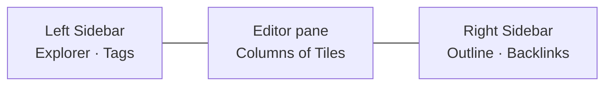

# App shell

The **app shell** is the top-level arrangement of [Panes](/GLOSSARY.md) inside the Sunstone window. `App.svelte` lays out three horizontal Panes with the [NavBar](/GLOSSARY.md) toolbar spanning the central one:

- The **left Sidebar** holds the **Explorer** and **Tags** Sections and starts expanded.
- The central **[Editor pane](/editor/editor-layout.md)** is a row of Columns, each a stack of Tiles — the app's primary surface. It is never hidden.
- The **right Sidebar** holds the **Outline** and **Backlinks** Sections and starts collapsed on a fresh Bundle.

Either Sidebar collapses entirely, letting the Editor pane take the full width. The `NavBar` renders the two Sidebar toggles (mirroring `leftSidebarOpen` / `rightSidebarOpen`) plus the editor view-mode and Properties controls.

## What lives where

| Pane | Sections | Default | Documented in |
| ---- | -------- | ------- | ------------- |
| Left Sidebar | Explorer, Tags | expanded (Tags collapsed, hidden if no tags) | [Sidebars](/interface/sidebars.md) |
| Editor pane | — (Columns of Tiles) | always visible | [Editor layout](/editor/editor-layout.md) |
| Right Sidebar | Outline, Backlinks | collapsed | [Sidebars](/interface/sidebars.md) |

**Properties** is neither a Pane nor a Section: it is chrome *inside* each Tile of the Editor pane, gated by one global show/hide flag. See [view state](/interface/view-state.md) for `propertiesShown`.

## Relationships

- The shell hosts the two [Sidebars](/interface/sidebars.md) and the central [Editor pane](/editor/editor-layout.md).
- Which surface owns the keyboard — and how `Alt`+arrows move between these Panes — is the [focus model](/interface/focus-model.md).
- Every collapse flag and the last-open layout survive relaunch via [view state](/interface/view-state.md).
- Terms are indexed in the [glossary](/GLOSSARY.md).
