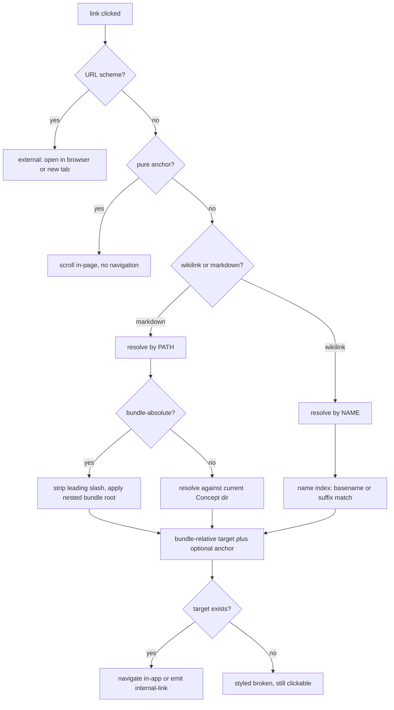

# Linking

Links are what turn a [Bundle](/GLOSSARY.md) of [Concepts](/GLOSSARY.md) into a wiki rather than a pile of files. Sunstone recognises **two distinct resolution models** side by side, plus anchors, citations, backlinks and automatic rewrite-on-move. This page is the map of all of them and the code that implements each.

The governing split — introduced by [ADR 0004](/adr/0004-wikilinks-optional-secondary-name-based.md):

- **Standard markdown links** (`[text](target)`) are the **primary/canonical** format and resolve by **path**. This is the only link form [OKF](/okf-spec.md#5-cross-linking) itself defines.
- **[Wikilinks](/GLOSSARY.md)** (`[[name]]`) are an **optional, secondary fallback** format, supported *in addition to* — never replacing — markdown links, and resolve by **name**. They exist purely as an Obsidian-compatibility affordance for Bundles that originate as Obsidian vaults.

Both are tolerated when broken: a link whose target does not exist is styled distinct but stays clickable and never blocks editing (OKF [§5.3](/okf-spec.md#53-link-semantics)).

## The pure-logic seam

All link resolution is **pure, DOM-free, IPC-free logic** so it can be unit-tested, and it is implemented **twice** — once in TypeScript and once in Rust — with the invariant that the two agree byte-for-byte. The frontend's broken-link decoration and the web renderer both trust the Rust [Bundle](/GLOSSARY.md) index precisely because the algorithms are mirrored.

| Concern | TypeScript (pure) | Rust (`sunstone-core`) | Mirrors |
|---------|-------------------|------------------------|---------|
| Markdown link resolution | `src/lib/links.ts` (`resolveLink`) | `paths.rs` (`resolve_internal`), `index/links.rs` | ✅ exact |
| Wikilink parse + resolve | `src/lib/links.ts` (`resolveWikilink`, `splitWikilinkTarget`) | `wikilink.rs` (`resolve_wikilink`) | ✅ exact |
| Heading slugs | `src/lib/slug.ts` (`slugify`, `slugifyHeadings`) | `slug.rs` (`slugify`) | ✅ exact |
| Rename/move rewrite | `src/lib/ipc/fake/links.ts` (`planRewrites`) | `rewrite/engine.rs`, `rewrite/paths.rs` | ✅ exact |
| Anchor rewrite | `src/lib/anchorRewrite.ts` (`rewriteAnchorsIn`) | `rewrite/anchors.rs` | ✅ exact |
| Citation refs | `src/lib/citations.ts` | — (frontend-only widget) | n/a |

The `.ts` helpers stay pure; the CodeMirror extensions (`src/lib/editor/*.ts`) and the fake backend (`src/lib/ipc/fake/*.ts`) sit thinly over them, and the real desktop/web backends use the Rust twin. The Rust duplication in `ipc/fake/links.ts` exists so the exact same behaviour runs under Chromium/Playwright.



## Markdown links (the OKF link structure)

`resolveLink(currentPath, href, opts?)` in `src/lib/links.ts` classifies every markdown link `href` into a `ResolvedLink`:

```ts
type ResolvedLink =
  | { kind: 'external'; href: string }
  | { kind: 'internal'; path: string; anchor: string | null }
  | { kind: 'none' };
```

- **External** — anything matching a URL scheme (`http:`, `https:`, `mailto:`, `tel:`, any `scheme:`). Detected by `isExternalLink`; never navigated in-app — the caller hands it to the OS/browser.
- **Bundle-absolute** — begins with `/`, resolved from the Bundle root (leading slash stripped). The **recommended** form because it survives a Concept moving within its subdirectory.
- **Relative** — `./x.md`, `../y.md`, or a bare `x.md`, resolved against the *directory of the current Concept*.
- **Pure anchor** (`#heading`) or empty → `kind: 'none'`: there is no target Concept to open; the caller scrolls within the current Concept instead.

Path math is done by `normalizeSegments`, which collapses `.`/`..` and refuses to escape above the root (leading `..` that would escape are dropped, matching the backend's escape rejection). A `path#anchor` is split: the path resolves and the `#anchor` rides along on the result so the caller can scroll to that heading after navigating.

### Nested bundle root

The folder Sunstone opens is not always the OKF Bundle root — a repository commonly keeps its Bundle under `docs/`, and bundle-absolute links (`/x.md`) are authored relative to *that* root. `findBundleRoot(allPaths)` identifies the root **structurally** (paths only, never frontmatter):

1. Any top-level `.md` (a root `index.md` or a root-level Concept) → the opened folder **is** the root (`''`). Never redirect down; a Bundle at the opened root is the common case.
2. Otherwise the shallowest directory carrying an `index.md`; on a depth tie prefer the canonical `docs/`, else only commit when a single candidate is shallowest.
3. No `index.md` anywhere → the sole shared top-level segment if every Concept has one, else `''` (don't guess).

`applyBundleRoot` then prepends the identified root to a bundle-absolute target **only when the rewritten path actually exists** (`opts.exists`). This safe fallback means a mis-identified root can never mis-navigate a link that would otherwise have worked — a wrong guess simply leaves the link unrooted.

## Wikilinks (`[[name]]`) — the name-based fallback

Wikilinks are the compatibility fallback to markdown links. Unlike markdown links they resolve by **filename, not path** — a fundamentally different model that [ADR 0004](/adr/0004-wikilinks-optional-secondary-name-based.md) introduces deliberately, with the design rule **match Obsidian exactly**.

`splitWikilinkTarget(raw)` splits the inner text of `[[ … ]]` into three parts (`WikilinkParts` — mirrored by Rust's `WikiTarget`):

- `name` — the file-match portion (the alias begins at the first `|`; the anchor at the first `#` *in the name part*, so an `#` inside an alias is display text, not an anchor).
- `alias` — display text after `|` (`[[name|display]]`), kept verbatim.
- `anchor` — `#heading` target after `#`, kept verbatim.

`resolveWikilink(allPaths, sourcePath, rawTarget)` then resolves the `name`:

- Strip `|alias`, then `#anchor`, then trim; an **empty** name (`[[#heading]]`) **falls back to `sourcePath`** — a pure same-file anchor.
- Drop a trailing case-insensitive `.md`.
- Match **case-insensitively and literally** — no slug/space normalisation (`[[Live Preview]]` matches `Live Preview.md`, not `live-preview.md`). The frontmatter `title` **never** participates.
- A **bare name** matches by **basename**; a **partial path** (`[[folder/name]]`) matches by **path suffix** (the whole path, or ending in `/name`).
- **Ties resolve silently** to the shortest path (fewest `/` segments), then lexicographically — ambiguity is *not* flagged broken (Obsidian behaviour).
- No match → `null` → styled broken, exactly like a broken markdown link.

### Wikilink fallbacks, layered

"Fallback" applies at several levels here — worth naming explicitly because it's the subtle part:

1. **Format fallback** — wikilinks are the secondary format Sunstone falls back to *supporting* for Obsidian-authored content; markdown links remain canonical. OKF does not use them.
2. **Empty-name fallback** — `[[#heading]]` with no name falls back to the source Concept (same-file anchor).
3. **Label fallback** — `labelFor` (in `src/lib/editor/wiki-links.ts`) shows the author's written name (what Obsidian displays); when the name is empty it falls back to the resolved file's basename.
4. **Unresolved fallback** — a name that resolves to nothing, *or* resolves to a path absent from the index, falls through to broken styling rather than erroring.

### Rendering wikilinks

`src/lib/editor/wiki-links.ts` reuses atomic-editor's built-in `wikiLinks` CodeMirror extension with a Sunstone `resolve`/`onOpen` adapter: `resolve` runs the synchronous `resolveWikilink` against the same cached index `exists()` that the broken-link decoration uses; `onOpen` navigates in-app and best-effort scrolls to the `#anchor`. The extension's resolve cache has no invalidation API, so the host wraps it in a CodeMirror `Compartment` and reconfigures it whenever the index changes, piggybacking on the same index signal that refreshes broken markdown links.

Upstream styles *all* aliased links (`[[target|label]]`) as resolved and never runs `resolve()` on them, so a `brokenAliasWikiLinkOverlay` view-plugin adds a `cm-atomic-wiki-link-missing` mark to the label of any aliased wikilink whose target does not resolve — making both bare and aliased broken wikilinks read as broken. On the web, `render.rs` rewrites `[[wikilinks]]` into marked markdown links before parsing, so the read-only viewer resolves them by the identical rules.

## Anchors and heading slugs

An anchor is the `#fragment` of a link (`/page.md#deep-section`, `[[page#deep-section]]`). Anchor targets are **GitHub-style heading slugs**, computed by `slugify` in `src/lib/slug.ts` (mirrored by Rust `slug::slugify`):

- lowercase (Unicode-aware);
- drop everything that is not a letter, digit, hyphen, or underscore;
- turn each whitespace character into a hyphen (runs of spaces → runs of hyphens; not collapsed);
- `slugifyHeadings` de-duplicates repeated slugs in document order by appending `-1`, `-2`, … (two `## Notes` → `notes`, `notes-1`), so it must run over the whole ordered heading list, never per-heading.

`slugify` trims first, so a hand-typed literal anchor (`#Deep Section`) and the canonical slug (`#deep-section`) compare equal — matching is backward-compatible and migrates older literal anchors to the canonical slug on the first heading change.

## Citations

Sunstone recognises two related but distinct things under the citation banner:

- **OKF citation links** — entries under a `# Citations` heading (OKF [§8](/okf-spec.md#8-citations)), numbered `[n]` at line start, whose targets may be external URLs, bundle-relative paths, or pages in a `references/` subdirectory. These are ordinary markdown links; nothing special beyond the convention.
- **Citation references** — inline `[n]` tokens that *follow a word* (`…deep umami and body.[6][7][8]`), which render as clickable **superscripts** that jump to the matching row of the citation table.

`src/lib/citations.ts` is the pure detector:

- `findCitationRefs(text)` finds every inline `[n]` that is immediately preceded by a non-whitespace character (a word, punctuation, or the `]` of an adjacent `[6][7]`) and not followed by `]` (a `[[wikilink]]` close), `(` (a real markdown link `[6](url)`), or `:` (a reference-link definition `[6]:`). Line-start `[n]` — the table rows — fail the "preceded by non-space" test and are skipped, so they stay literal and act as jump targets.
- `citationDefPos(text, num)` returns the offset of the definition row (first line whose first non-blank content is `[num]`), or `null` for a dangling reference.

`src/lib/editor/citations.ts` is the thin CodeMirror layer: a `CitationWidget` superscript, a click handler that scrolls to the definition and briefly flashes it, active in hybrid + reading modes (in hybrid the raw token is revealed under the cursor for editing; absent in source `edit` mode).

## Broken links

Broken links are **tolerated**, never blocked (OKF [§5.3](/okf-spec.md#53-link-semantics)). `src/lib/editor/broken-links.ts` walks the syntax tree, resolves each `Link` node's URL with `resolveLink`, and marks it `cm-broken-link` (dashed/red) when it resolves to an internal target absent from the index — styling only; the link stays clickable. The check is synchronous against the frontend index store's cached path set (CodeMirror decorations cannot await IPC) and re-runs on doc changes and on an explicit `refreshBrokenLinks` effect (fired on the `file-changed` watcher event and on Concept switch, so created/removed targets restyle without a reload).

## Backlinks

The inverse of an outbound link. The Rust `backlinks(path)` command (`src-tauri/src/lib.rs`) returns every Concept that links *to* a given Concept, powering the **Backlinks** [Section](/GLOSSARY.md). It is built from outbound-link extraction — `index/links.rs` (markdown) plus `wikilink.rs` (wikilinks) in Rust, mirrored by `outboundLinks` in `src/lib/ipc/fake/links.ts`. Both markdown links and wikilinks feed backlinks; self-edges (e.g. a pure same-file `[[#heading]]`) are dropped. Extraction masks fenced code blocks and inline code first (`maskCode`) so `[[ … ]]` written inside code is never picked up.

## Rename & move rewrite

When a Concept or folder is renamed/moved, Sunstone **automatically rewrites the affected links** so nothing breaks — inbound links from other Concepts and the moved Concept's own outbound links. `planRewrites(from, to)` in `src/lib/ipc/fake/links.ts` mirrors the Rust `rewrite` engine:

- **Inbound absolute** links (`/old.md`) → the new absolute path.
- **Inbound & outbound relative** links → recomputed from the source's own directory, preserving relative style (`./`, `../`).
- **Bare wikilinks** (`[[old]]`) rewrite **only when the basename changes** — a pure folder move leaves them untouched, since bare names resolve bundle-wide anywhere.
- **Partial-path wikilinks** (`[[a/old]]`) rewrite to the **shortest suffix that still resolves** to the new path in the new Bundle.
- `|alias`, `#anchor`, `?query`, link titles, link text and external links are all preserved verbatim; only links whose resolved target actually moved change.

Separately, `rewriteAnchorsIn` (`src/lib/anchorRewrite.ts`, mirroring `rewrite/anchors.rs`) rewrites the `#anchor` of every link pointing at a heading whose slug changed — both cross-file inbound links (via the backend) and same-file `[[#slug]]` links in the open editor buffer (`source === target`). Both sides are slugged before comparison, so an older literal anchor is migrated to the canonical slug on the first heading rename.

## Out of scope

Deferred per [ADR 0004](/adr/0004-wikilinks-optional-secondary-name-based.md): embeds (`![[ … ]]`), block references (`#^`), and `[[`-autocomplete. The wikilink scanner matches only `[[ … ]]`, so `![[ … ]]` renders as a literal `!` plus a wikilink.

## Related

- [Open Knowledge Format (OKF) Specification](/okf-spec.md) — §5 cross-linking, §8 citations, the format Sunstone's links conform to.
- [Glossary](/GLOSSARY.md) — the **Wikilink**, **Backlinks**, and **Diagram** (graph sense) terms.
- [ADR 0004 — Wikilinks as an optional, name-based secondary link format](/adr/0004-wikilinks-optional-secondary-name-based.md).
- [Editor layout](/editor-layout.md) — links open Concepts into Tiles.
