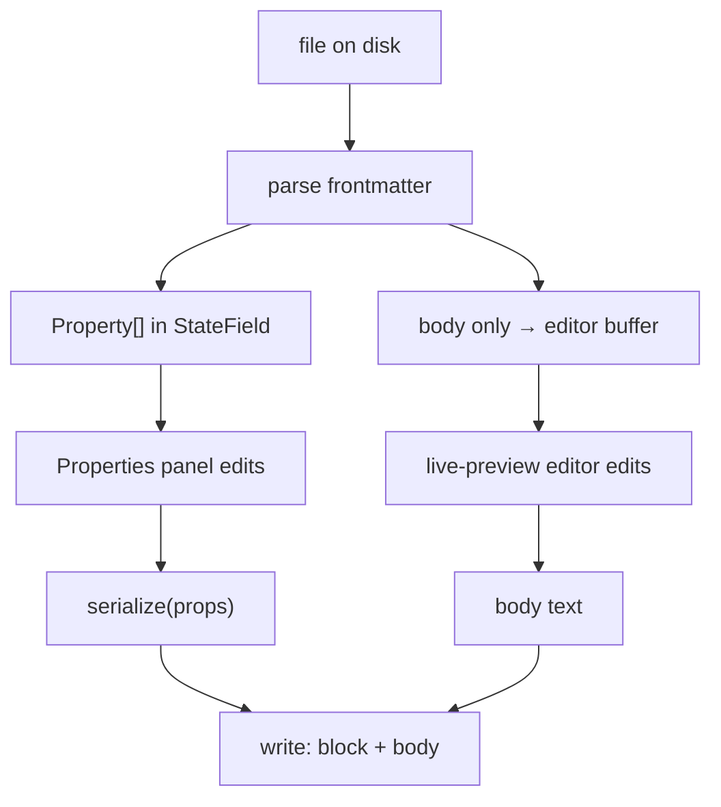

# Concept

A **[Concept](/GLOSSARY.md)** is a single unit of knowledge — **one `.md` file** inside a [Bundle](/okf/bundle.md). This page extracts the concept-level rules from the [OKF spec](/okf/spec.md) and records how Sunstone models a Concept's frontmatter and body, including where it extends or deliberately relaxes the spec.

## What OKF says

From [spec §4](/okf/spec.md#4-concept-documents) and [§2](/okf/spec.md#2-terminology):

- A Concept is a UTF-8 markdown file with two parts: a **YAML frontmatter block** (`---`-delimited) and a free-form **markdown body**.
- Its **Concept ID** is the file path within the Bundle **minus the `.md`** — `tables/users.md` ⇒ `tables/users`.
- **Frontmatter** ([§4.1](/okf/spec.md#41-frontmatter)) has exactly one **required** field, `type` (a short, self-describing, un-registered kind string). Recommended, in priority order: `title`, `description`, `resource`, `tags`, `timestamp`. Producers **MAY** add any keys; consumers **SHOULD preserve unknown keys** when round-tripping and must not reject documents for unrecognised fields.
- **Body** ([§4.2](/okf/spec.md#42-body)) is standard markdown; producers should favour structural markdown (headings, tables, lists, fenced code) over prose. Three headings carry **conventional** meaning: `# Schema`, `# Examples`, `# Citations` ([§8](/okf/spec.md#8-citations)).
- A Concept is [conformant](/okf/spec.md#9-conformance) if its frontmatter parses and `type` is non-empty; consumers must tolerate missing optional fields, unknown types, unknown keys, and broken links.

## How Sunstone models a Concept

### Frontmatter

Sunstone does **not** edit the YAML text in place. While a Concept is open, its frontmatter is held as **structured `Property[]` state in a CodeMirror `StateField`** — the single source of truth — and the YAML block is **stripped from the editor document entirely** (the editor buffer holds only the body). It is edited through the **Properties** panel, not by typing YAML; scalars are text inputs and flat lists (e.g. `tags`) are chips. On every change the whole block is **re-serialized** (`serialize(props)` + body) to produce the on-disk file. This is [ADR 0003](/adr/0003-structured-frontmatter-reserialization.md), superseding the in-place verbatim splice of [ADR 0002](/adr/0002-flat-frontmatter-model.md).

Consequences that matter for spec conformance:

- **Unknown keys survive.** Keys Sunstone doesn't model specially — nested maps, multi-line/block scalars, any producer-defined field — are classified `complex`, carry their original source text in `raw`, and are re-emitted faithfully. This honours [§4.1](/okf/spec.md#41-frontmatter)/[§9](/okf/spec.md#9-conformance)'s "preserve unknown keys." They stay **read-only** in the panel; the round-trip must stay test-covered.
- **Cosmetics do not survive.** Comments, quoting style (`'note'` → `note`), and incidental whitespace of re-emitted fields are lost after the first edit. OKF requires none of these — this is expected, not a bug — but it is the concrete way Sunstone's round-trip differs from a byte-preserving one.
- **Recommended keys are surfaced.** The Properties autocomplete offers OKF's recommended keys (`type`, `title`, `description`, `resource`, `tags`, `timestamp`) — `OKF_KEYS` in `src/lib/state/suggestions.svelte.ts` — nudging authors toward [§4.1](/okf/spec.md#41-frontmatter) without requiring them.
- **`type` is not enforced.** The spec _requires_ `type`, but Sunstone deliberately **does not nag**: the required-`type` warning was removed so files in directories that don't follow OKF aren't pushed toward conformance. Sunstone applies the spec's permissive **consumer** stance to itself even as an **editor** — a missing `type` is tolerated, not flagged.
- **Reserved files are exempt.** `index.md`/`log.md` carry no frontmatter and show no Properties panel (see [Bundle → reserved files](/okf/bundle.md#reserved-files)).



### Body

The body is where Sunstone's viewer/editor adds the most beyond plain markdown — all of it layered _over_ standard markdown so a non-Sunstone consumer still reads the file fine:

- **Live preview** — Obsidian-style hybrid editing (source is truth; inactive lines render styled, the cursor line shows raw markup) via CodeMirror 6 decorations. See [ADR 0001](/adr/0001-codemirror-hybrid-live-preview.md) and the [editor docs](/editor/index.md).
- **Outline** — the open Concept's headings in document order, derived live from the body (**frontmatter and fenced code excluded**). Powers the **Outline** [Section](/GLOSSARY.md).
- **Diagrams** — ` ```mermaid ` fenced blocks are **rendered** as diagrams. To the spec these are just fenced code ([§4.2](/okf/spec.md#42-body)); Sunstone renders them via its own block-replace CodeMirror field (`securityLevel: 'strict'`, lazy-loaded). See [ADR 0005](/adr/0005-mermaid-block-rendering.md).
- **Citations** — Sunstone honours OKF's `# Citations` convention ([§8](/okf/spec.md#8-citations)) _and_ adds inline **citation-reference superscripts**: a `[n]` token following a word renders as a clickable superscript that jumps to the matching `[n]` row. This is a Sunstone affordance beyond the spec. See [Linking → Citations](/okf/linking.md#citations).
- **Wikilinks** — `[[name]]` links resolve by filename, a Sunstone-only secondary link form (OKF uses path-based markdown links only). See [Linking](/okf/linking.md) and [ADR 0004](/adr/0004-wikilinks-optional-secondary-name-based.md).
- **CriticMarkup** and other custom extensions round out the [editor's own extensions](/editor/custom-extensions.md).

The `# Schema` / `# Examples` conventional headings ([§4.2](/okf/spec.md#42-body)) get no special treatment — they are plain headings that flow into the Outline like any other.

## Where Sunstone deviates from the pure spec

| Topic | Pure OKF | Sunstone |
| --- | --- | --- |
| Frontmatter round-trip | Preserve unknown keys; cosmetics unspecified | Whole-block **re-serialize**; unknown keys kept via `raw`, **cosmetics dropped** ([ADR 0003](/adr/0003-structured-frontmatter-reserialization.md)) |
| Editing frontmatter | Edit the YAML text | YAML **stripped from the editor**; edited via the **Properties** panel |
| Required `type` | REQUIRED | Tolerated, **not enforced** — no conformance nag |
| Mermaid | Just fenced code | **Rendered** as diagrams ([ADR 0005](/adr/0005-mermaid-block-rendering.md)) |
| Citations | `# Citations` links ([§8](/okf/spec.md#8-citations)) | Same, **plus** inline `[n]` superscript refs |
| Links in body | Path-based markdown links ([§5](/okf/spec.md#5-cross-linking)) | Adds name-based **[Wikilinks](/GLOSSARY.md)** ([ADR 0004](/adr/0004-wikilinks-optional-secondary-name-based.md)) |

## Related

- [Bundle](/okf/bundle.md) — the directory tree of Concepts, its root detection, indexes, and git write path.
- [OKF Specification](/okf/spec.md) — the vendored spec, §4 (concepts), §8 (citations), §9 (conformance).
- [ADR 0002](/adr/0002-flat-frontmatter-model.md) · [ADR 0003](/adr/0003-structured-frontmatter-reserialization.md) — the frontmatter model.
- [ADR 0005](/adr/0005-mermaid-block-rendering.md) — mermaid rendering.
- [Linking](/okf/linking.md) — wikilinks, citations, anchors, backlinks.
- [Editor](/editor/index.md) — the CodeMirror integration hosting the body.
