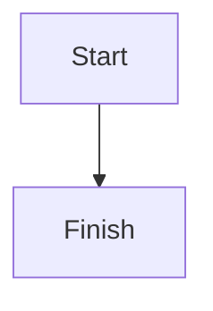

# Diagram Concept

A valid flowchart Diagram:



A malformed diagram that must degrade gracefully:

```mermaid
not a valid mermaid diagram !!!
```

Body text after the diagrams so the page clearly stays intact.
